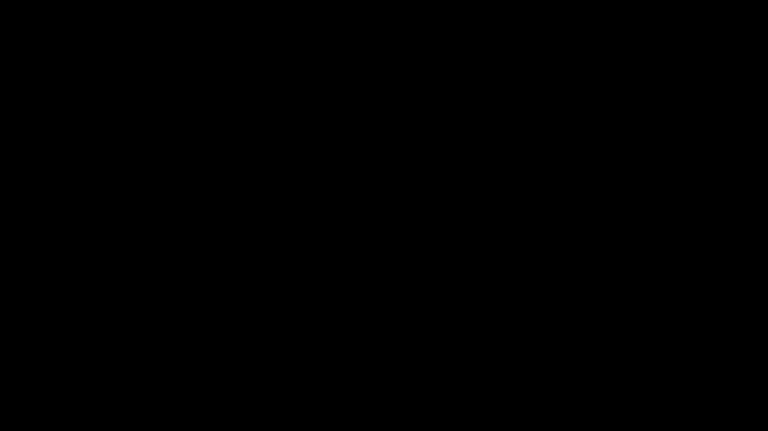
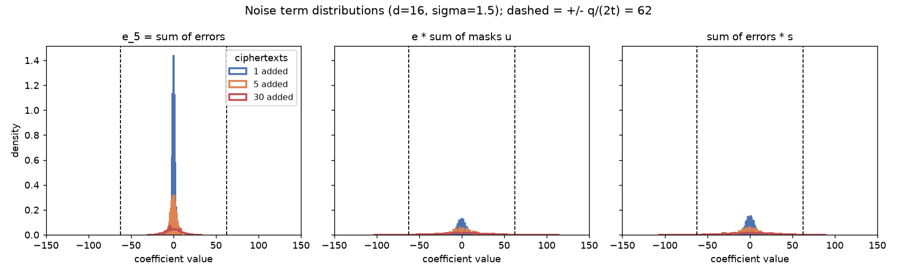
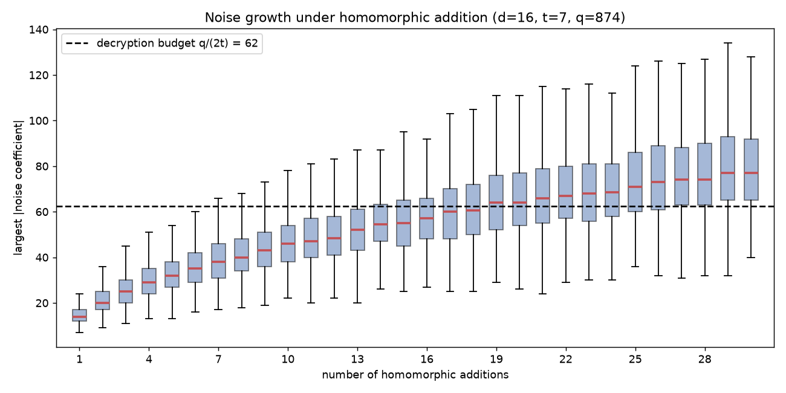

> This post is a rewrite and extension of Stephen Hardy's excellent
> *"A Homomorphic Encryption Illustrated Primer"* (originally on
> n1analytics.com, 2018). I have kept his illustrative FV example and added a
> ground-up **Learning With Errors** foundation, animations, and reproducible
> code. All credit for the original explanation and the toy example is his.

Imagine handing a locked box of numbers to a stranger, asking them to do your
arithmetic *inside the box*, and getting back a locked box with the right
answer, all without them ever seeing a single digit. This process is called **homomorphic encryption**. It allows you to compute on data that you cannot read.

Cryptographers have wanted this for almost the entire history of the field.
The problem was posed in 1978, one year after RSA, under the name *privacy
homomorphisms*, and it then resisted everyone for thirty-one years, picking up
the nickname "the holy grail of cryptography" along the way. When Craig Gentry
finally built the first fully homomorphic scheme in 2009, the shock was not
just that it worked, but *how* it worked. The same noise that protects the data is gently steered so that mathematical operations can flow around it. Every practical scheme
since, including the one in this post, runs on that idea.

It sounds impossible. This post is about *why it is not*. If you can read
Python and remember what `%` does, you have all the math you need. By the end
you will understand a real scheme, the **Fan-Vercauteren (FV)** scheme, well
enough to follow its equations line by line, and to run it yourself.

Here is the plan:

1. **The one idea** - hide a value under a noisy mask.
2. **Learning With Errors (LWE)** - the simplest concrete version.
3. **Ring-LWE** - swap clumsy vectors for arrays-with-a-twist (polynomials).
4. **The FV scheme** - keys, encryption, decryption, with a worked example.
5. **Homomorphic operations** - adding and multiplying ciphertexts, and the
   noise that comes with it.
6. **Extensions** - batching, bootstrapping, and how security is chosen.

Between parts 3 and 4 there is also an **interlude** that opens the hood on
the underlying math. We will cover roots of unity, the NTT, the Chinese Remainder Theorem, and what a "lattice" actually is. If you have ever used an FFT or sharded a
database, you already know more of that material than you think.

### How to read the math

There are equations ahead, but only a handful of symbols, and each one maps
directly to a line of Python:

| Symbol | Read it as | In Python |
|---|---|---|
| $x \bmod q$ | wrap $x$ into range, clock-style | `x % q` |
| $[x]_q$ | wrap into the *signed* range $(-q/2,\, q/2]$ | `(x + q//2) % q - q//2` |
| $\lfloor x \rceil$ | round to the nearest integer | `round(x)` |
| $\vec a \cdot \vec s$ | dot product | `sum(a[i]*s[i] for i in range(n))` |
| $\Delta$ | the message scaling factor $\lfloor q/t \rfloor$ | `delta = q // t` |
| polynomial of degree $< d$ | just an array of $d$ ints | `np.zeros(d, dtype=np.int64)` |

The signed-range trick $[x]_q$ deserves one beat of attention, because we use
it everywhere. It is exactly like the difference between `uint8` and `int8`. The byte `0xFF` is 255 if you read it as unsigned, and -1 if you read it as signed. Same bits, different
label. We prefer the signed view because in this scheme "small" always means
"near zero", and $-1$ is small while $255$ does not look small.

Strap in.

---

## 1. The one idea

Every scheme in this post is a variation on a single move. Take the number you
want to protect, and:

1. **scale it up** so it occupies the "high bits" (call the scaled message
   $\Delta m$),
2. **add a big, random-looking mask** so the result looks like noise,
3. **add a little extra noise** $e$ down in the "low bits".

The result is your ciphertext. If you hold the secret, you can *subtract the
mask exactly*, leaving $\Delta m + e$. This leaves the message in the high bits and the noise in the low bits. Divide by $\Delta$ and **round**, and the noise falls away like
truncated low bits.



That is the entire story. Everything below is about making "mask" and "cancel
the mask" precise, and about keeping the noise small enough to round away even
after we compute on the ciphertext.

Two questions should be nagging you:

- *Why add noise at all?* The mask is like a one-time pad, but a **linear**
  one: it is built from additions and multiplications, which is exactly what
  lets arithmetic pass through it. Linear structure alone would also let an
  attacker solve for the pad with linear algebra. The noise is the wrench in
  that plan. It turns "solvable with Gaussian elimination" into a genuinely
  hard problem.
- *Why does rounding not destroy the message?* Because scaling by $\Delta$
  gives each message value a wide "lane" (think: each value owns $\Delta$
  consecutive integers). As long as noise stays inside the lane, rounding
  snaps back to the right value. If it ever leaves the lane, we decode the
  wrong message. Managing that error margin is the central engineering problem
  of the whole field.

---

## 2. Learning With Errors

### Numbers on a clock

All our arithmetic happens **modulo** some integer $q$, which means numbers wrap around like a clock or like a fixed-width integer overflow. For example, on a 24-hour clock, $21 + 6 \equiv 3$ because you pass 24 and keep going. In code, `(21 + 6) % 24 == 3`.


If you have ever debugged unsigned integer overflow, you already have the
intuition. Arithmetic using `uint32` *is* simply arithmetic modulo $2^{32}$. The only novelty
here is that we pick moduli that are not powers of two, and that we usually
relabel the top half as negatives (the signed view from the cheat sheet), so
mod 24 runs $-11 \dots 12$ instead of $0 \dots 23$.

### The LWE sample

Fix a secret array $\vec s = (s_1, \dots, s_n)$ with small entries. Now
generate a uniformly random array $\vec a$ and compute

$$ b = \vec a \cdot \vec s + e \pmod q $$

where $e$ is a small random error. In Python, this looks like:

```python
a = [random.randrange(q) for _ in range(n)]      # public, uniform
e = round(random.gauss(0, sigma))                # tiny, e.g. -2..2
b = (sum(ai * si for ai, si in zip(a, s)) + e) % q
```

The pair $(\vec a,\, b)$ is called an **LWE sample**. It consists of a random vector, its dot product with the secret, and a small amount of random noise.


Here is the crucial fact that forms the entire foundation of the security.

> **Given as many samples $(\vec a,\, b)$ as you like, recovering $\vec s$ is
> believed to be computationally hard**, even for a quantum computer.

Why should that be hard? Without the error it is not: each sample is one linear
equation in the unknowns $s_1 \dots s_n$, so collect $n$ samples and solve the
system, the way you solved simultaneous equations in school (Gaussian
elimination, $O(n^3)$, trivial). But elimination works by scaling and
subtracting equations from each other, and every one of those steps
**amplifies the error terms**. After a few eliminations the errors have
snowballed and drowned out the very values you were solving for. The tiny $e$
is load-bearing: it is what turns easy linear algebra into the
**Learning With Errors** problem. This is one of the most studied hard problems in post-quantum cryptography.

And here is my favorite fact in this whole subject. Most of cryptography rests
on problems assumed hard *on average*, because nobody has broken a random
instance yet. LWE comes with something stronger. When Oded Regev introduced it
in 2005, he proved that breaking *randomly generated* LWE instances is at
least as hard as solving the **worst case** of certain lattice problems, which are the most difficult instances that exist. Your randomly generated key is provably
as strong as the hardest problem in the family. Guarantees of that shape are
almost unheard of; it is a big part of why lattices took over post-quantum
cryptography. (What "lattice problem" actually means: see the interlude.)

### Encrypting and decrypting with LWE

To encrypt a message $m \in \{0, \dots, t-1\}$, lift it into the high bits with
the scaling factor $\Delta = \lfloor q/t \rfloor$ and hide it inside a sample:

$$ b = \vec a \cdot \vec s + e + \Delta m \pmod q, \qquad \text{ciphertext} = (\vec a,\, b). $$

To decrypt, use the secret to strip the mask, then rescale and round:

$$ b - \vec a \cdot \vec s = \Delta m + e \pmod q
   \qquad\Rightarrow\qquad
   m = \left\lfloor \tfrac{1}{\Delta}\,(b - \vec a \cdot \vec s) \right\rceil. $$

The same thing, in code:

```python
delta = q // t
b = (dot(a, s) + e + delta * m) % q         # encrypt
m = round(signed(b - dot(a, s), q) / delta) % t   # decrypt
```

Decryption succeeds as long as $|e| < \Delta/2$, i.e. the noise stays inside
the message's lane. Treat that inequality as a **noise budget**: a resource
every ciphertext is born with, which every operation will spend. It is the
quantity we track for the rest of the post.

### Adding encrypted numbers, for free

Watch what happens if we add two ciphertexts element-wise:

$$ (\vec a_1, b_1) + (\vec a_2, b_2) = (\vec a_1 + \vec a_2,\ b_1 + b_2). $$

Expanding $b_1 + b_2$:

$$ (\vec a_1 + \vec a_2)\cdot \vec s + (e_1 + e_2) + \Delta(m_1 + m_2). $$

Squint at that: it has *exactly the shape of a fresh encryption of
$m_1 + m_2$*, under the same secret, with mask $\vec a_1 + \vec a_2$ and noise
$e_1 + e_2$. So the decryption routine, which knows nothing about how this
ciphertext was produced, will happily return $m_1 + m_2$. We added two
encrypted numbers **without decrypting them**. That is the "homomorphic" magic,
and it is almost suspiciously easy.

The catch is in the noise term: $e_1 + e_2$. Every addition spends budget. Do
it too many times and the accumulated noise escapes the lane.

### Why move to rings?

Plain LWE works, but look at the cost: every single number you encrypt drags a
whole random vector $\vec a$ behind it, thousands of entries long, and the only
useful payload is one dot product. It is like sending a container ship to
deliver one envelope.

The fix is a classic engineering move: find a structure where one operation
does $n$ operations' worth of work. Here that structure is **polynomial
multiplication**, which computes something equivalent to $n$ dot products at
once. LWE upgraded with polynomials is called **Ring-LWE**, and it is what real
schemes like FV use.

---

## 3. Ring-LWE: from vectors to polynomials

### A polynomial is just an array

Do not let the word "polynomial" raise your heart rate. For our purposes a
polynomial *is* an array of integers, and nothing more:

$$ a_{d-1} x^{d-1} + \dots + a_2 x^2 + a_1 x + a_0
   \quad\Longleftrightarrow\quad
   \texttt{[a0, a1, a2, ..., a\_d-1]} $$

The $x$'s are never evaluated at any value; they are position markers, the way
the "tens place" is a position marker in decimal. Index $i$ of the array holds
the coefficient of $x^i$. Every coefficient lives on our clock: mod $t$ for
plaintexts, mod $q$ for ciphertexts.


Adding two polynomials is element-wise array addition. The interesting part is
multiplication.

### The wrap-around rule: $x^d + 1$

We keep our arrays at a fixed length $d$ (a power of two; we will use $d = 16$
for illustration). But multiplying two degree-15 polynomials produces terms up
to $x^{30}$, which do not fit. Where do they go?

The scheme adopts one reduction rule, called working modulo $x^{16} + 1$, and
everything follows from its one consequence:

$$ x^{16} \equiv -1. $$

So any term that overflows the array wraps around to the bottom **and flips
its sign**:

$$ x^{18} = x^{16} \cdot x^2 = -x^2. $$

If you have ever written a ring buffer, this is a ring buffer with one extra
twist: `index % 16` as usual, but each full wrap multiplies the value by $-1$.
That sign flip (which comes from the "+1" in $x^{16}+1$) is not a nuisance; it
is a feature that scrambles products nicely, and it is why this exact modulus
is used. (It also has a beautiful secret identity, revealed in the interlude
after this section: $x$ is a rotation.)

### Multiplication is "rotate and reflect"

Because of the rule, multiplying a term by a power of $x$ **rotates** it around
the 16 slots and **reflects its sign** whenever it wraps past the top:

$$ 2x^{14} \cdot x^4 = 2x^{18} \equiv -2x^2 \pmod{x^{16}+1}. $$


Full polynomial multiplication just does this for every pair of terms and adds
the results up. In code it is a convolution plus the wrap rule, and it fits in
eight lines:

```python
def negacyclic_raw(a, b, d):
    full = np.convolve(a, b)          # ordinary polynomial product
    reduced = np.zeros(d, dtype=np.int64)
    for i, coeff in enumerate(full):
        if i < d:
            reduced[i] += coeff
        else:
            reduced[i - d] -= coeff   # x^i = x^(i-d) * x^d = -x^(i-d)
    return reduced
```

That is the entire algebraic machinery of the scheme. (The math literature
calls this structure the ring $\mathbb{Z}_q[x]/(x^d+1)$ and this operation
"negacyclic convolution"; you can now read both of those as "fixed-size int
arrays with the rotate-and-reflect multiply".)

**Ring-LWE** is LWE with arrays-and-dot-products replaced by
polynomials-and-this-multiply. One polynomial product mixes every coefficient
with every other, doing the work that previously took a whole matrix of
samples.

---

## Interlude: the math under the hood

You can build the full scheme knowing only what we have covered so far, and if
you are impatient you may skip ahead to part 4. But a few phrases have been
doing quiet work in the background - *roots of unity*, *cyclotomic*, *NTT*,
*lattice problem* - and each of them maps onto something you probably already
know from engineering. Sections 4-6 will point back here.

### Roots of unity: numbers that rotate

An **$n$-th root of unity** is any number $\omega$ satisfying $\omega^n = 1$:
multiply by it $n$ times and you are back where you started.

Over the complex numbers, these are the $n$ points spaced evenly around the
unit circle, and multiplying by one of them **rotates** you $1/n$ of a turn.
That is the picture to keep: *a root of unity is a rotation written as a
multiplication*. It is `i = (i + 1) % n`, wearing multiplicative clothing.

Now look again at our wrap rule from part 3:

$$ x^{16} \equiv -1 \qquad\Rightarrow\qquad x^{32} \equiv 1. $$

The symbol $x$ **is a 32nd root of unity**: one multiplication by $x$ is a
rotation by 1/32 of a turn. Sixteen steps is half a turn, and on a circle the
point half a turn from $1$ is $-1$. That is the entire content of the
mysterious sign flip: **"rotate and reflect" is just rotation, and the
reflection is what passing the halfway mark looks like.**


Watch the animation until the fourth hop. The moment the dot lands on $-1$ is
the moment the "+1" in $x^{16}+1$ stops being a syntax rule and becomes
geometry: negation *is* the far side of the circle.

This also defuses a scary word from part 3. The polynomial $x^{16}+1$ is
called the **32nd cyclotomic polynomial**, the polynomial whose roots are
exactly the "fresh" (primitive) 32nd roots of unity. *Cyclotomic* is Greek for
**circle-cutting**. The intimidating vocabulary is a picture of a pizza cut
into 32 slices.

### You do not need complex numbers for this

Here is the part that surprises most engineers: the integers mod $q$ contain
their own roots of unity. No floats, no `complex128`. Watch the powers of 2
mod 17:

```python
>>> [pow(2, k, 17) for k in range(1, 9)]
[2, 4, 8, 16, 15, 13, 9, 1]
```

Eight distinct values and back to 1: the integer 2 behaves mod 17 exactly like
a rotation by 1/8 of a turn. And halfway through the cycle:

```python
>>> pow(2, 4, 17)
16          # 16 is -1 mod 17: half a turn is negation, again
```


It is the same movie as before, with the complex plane deleted. Eight
integers, arranged in the cycle that multiplication-by-2 drives, behaving
pixel-for-pixel like the rotating dot on the unit circle. When a structure
survives having its scaffolding removed like this, that is usually math's way
of telling you the structure was the real thing all along.

The scheme wants a $2d$-th root of unity mod $q$, and (for prime $q$) one
exists precisely when $q \equiv 1 \pmod{2d}$. For our toy $d = 16$, the prime
$q = 257$ works:

```python
>>> pow(136, 16, 257)
256         # -1 mod 257, so 136 is a 32nd root of unity mod 257
```

This is why FHE libraries are full of oddly specific primes. When you see
`132120577` in a Microsoft SEAL parameter set, that is not superstition: it is
a prime with $q \equiv 1 \pmod{8192}$, chosen so that the rotations exist for
$d = 4096$.

### The NTT: an FFT for integers

Why do we care that modular rotations exist? Speed.

The convolution loop in `negacyclic_raw` is $O(d^2)$: fine for $d = 16$,
painful for $d = 4096$, and FHE executes it constantly. The classic fix, the
same one behind fast big-integer multiplication and DSP convolution, is to
change representation:

```text
coefficient form --(evaluate at d special points)--> value form
value form:       multiply pointwise                 O(d)
value form  --(interpolate back)-->                  coefficient form
```

When the evaluation points are the powers of a root of unity, both transforms
are the FFT, and the whole multiply costs $O(d \log d)$. Doing this with
complex numbers drags in floating point and rounding error, unacceptable in
cryptography where every bit must be exact. Doing it with a root of unity
**mod q** keeps everything in exact integer arithmetic, and that is the
**Number Theoretic Transform (NTT)**: the FFT, retargeted from `complex128` to
`int64 % q`. (A tidy bonus: evaluating at the *odd* powers of the 32nd root
bakes the $x^{16} = -1$ sign flip directly into the transform, so the
rotate-and-reflect wrap costs nothing extra.)


A useful mental model for reading real FHE code: a production library is,
computationally, an NTT machine. Profile one under load and you will find it
spending most of its life in NTT butterflies, with the same memory access
pattern as every FFT kernel you have ever seen.

### The Chinese Remainder Theorem: sharding for numbers

One more tool, and you already operate it in production: sharding.

A number mod 15 is fully determined by its remainders mod 3 and mod 5:

```python
>>> x = 11
>>> (x % 3, x % 5)
(2, 1)                                  # the two shards
>>> [z for z in range(15) if (z % 3, z % 5) == (2, 1)]
[11]                                    # shards uniquely identify the value
```

Better: arithmetic **respects the shards**. Add or multiply numbers mod 15 and
each shard evolves independently, as if the other did not exist:

```python
>>> y = 7
>>> ((x + y) % 15) % 3 == (x % 3 + y % 3) % 3
True
>>> ((x * y) % 15) % 5 == ((x % 5) * (y % 5)) % 5
True
```

This concept is known as the **Chinese Remainder Theorem (CRT)**. It means that arithmetic modulo 15 operates like two independent machines (modulo 3 and modulo 5) running in parallel behind a single interface. Notice what kind of map "split into shards" is: it converts + into
shard-wise + and $\times$ into shard-wise $\times$. It preserves the
operations. It is a *homomorphism*, the same word as in this post's title.


Hold that thought for part 6: with the right choice of $t$, the entire
plaintext polynomial ring shards the same way, into $d$ independent slots,
turning one ciphertext into a SIMD register of $d$ encrypted values. And the
shard decomposition is computed by, of course, evaluating at roots of unity.

### What is a "lattice", anyway?

Finally, the word that names the whole field: LWE belongs to **lattice-based
cryptography**. A lattice is every point you can reach from the origin by
taking *integer* steps along a fixed set of basis vectors: a perfectly
regular, infinite grid, possibly skewed. In 2D you can draw one on graph
paper. In cryptography, the dimension is in the hundreds or thousands.


The connection to LWE: collect the samples into $\vec b = A\vec s + \vec e$.
The set of all *noiseless* values $A\vec s$ forms a lattice, so the attacker's
job is: "here is a point $\vec b$ lying *near* the grid; find the exact grid
point it snapped off of." In 2 dimensions that is trivial. In dimension 1000
it is brutally hard: the best known algorithms (lattice reduction, LLL and
BKZ) cost time exponential in the dimension, and decades of effort, quantum
algorithms included, have not broken through that wall. When a parameter
table advertises "128-bit security", it is reporting exactly this: $d$ and $q$
sized so the best lattice-reduction attack costs on the order of $2^{128}$
operations.

---

## 4. The Fan-Vercauteren scheme

Now we assemble a real scheme. Here is its API; the rest of this section
implements it.

```text
keygen()           -> (pk, sk)      # pk: pair of polys mod q, sk: small poly
encrypt(pk, m)     -> ct            # m: poly mod t, ct: pair of polys mod q
decrypt(sk, ct)    -> m
add(ct_a, ct_b)    -> ct            # decrypts to m_a + m_b
mul(ct_a, ct_b)    -> ct            # decrypts to m_a * m_b (ct grows, sec. 5)
```

A plaintext is a polynomial with coefficients mod $t$; a ciphertext is a
**pair** of polynomials with coefficients mod $q$, where $q \gg t$. For a real
deployment you might see $d = 4096$, $t \approx 2.9\times10^8$ and
$q \approx 9.2\times10^{18}$ (yes, that is "coefficients are `uint64`s"). To
keep every number readable we use the primer's toy parameters:

$$ d = 16, \qquad t = 7, \qquad q = 874, \qquad \Delta = \lfloor q/t \rfloor = 124. $$

> **These parameters are not secure.** They exist only so the numbers fit on a
> screen. Real security comes from large $d$ and carefully chosen $q, t$.

### Keys

The **secret key** $s$ is a small polynomial, coefficients drawn from
$\{-1, 0, 1\}$. To build the **public key**, generate a uniformly random
polynomial $a$ (coefficients mod $q$) and a small error $e$, then publish

$$ \mathbf{pk} = \big(\,[-a\,s + e]_q,\ a\,\big). $$

```python
s = ternary()                        # coeffs in {-1, 0, 1}   (secret)
a = uniform_q()                      # coeffs uniform mod q   (public)
e = small_error()                    # discarded after keygen
pk = (mod_q(-mul(a, s) + e), a)
```

![The public key hides the secret: $\mathbf{pk} = ([-as + e]_q, a)$ is a Ring-LWE sample.](assets/s06_keygen.gif)

Look closely: $(-as+e,\ a)$ is exactly a Ring-LWE sample. The random $a$
scrambles $s$, and the small $e$ makes solving back for $s$ the hard Ring-LWE
problem. Without $e$, an attacker could recover $s$ with straightforward
algebra. The public key acts as a mathematical puzzle where the answer is the secret key. It is published publicly because it is computationally too difficult for anyone to solve. For a real-world analogy, think of the public key as an open padlock that you hand out to everyone. Anyone can place a message in a box and snap the padlock shut, but only you hold the physical key (the secret key) to open it again.

### Encryption

To encrypt a plaintext $m$, draw a fresh small polynomial $u$ (coefficients in
$\{-1,0,1\}$, think of it as a one-time randomizer) and two small errors
$e_1, e_2$, then form the pair

$$ \mathbf{ct}_0 = [\,\mathbf{pk}_0\, u + e_1 + \Delta m\,]_q, \qquad
   \mathbf{ct}_1 = [\,\mathbf{pk}_1\, u + e_2\,]_q. $$

```python
u, e1, e2 = ternary(), small_error(), small_error()
ct0 = mod_q(mul(pk[0], u) + e1 + delta * m)   # message rides in here
ct1 = mod_q(mul(pk[1], u) + e2)               # helper for unmasking
```

![Encryption: $\mathbf{ct}_0 = [\mathbf{pk}_0 \cdot u + e_1 + \Delta m]_q$, $\mathbf{ct}_1 = [\mathbf{pk}_1 \cdot u + e_2]_q$. The message rides in the high part of $\mathbf{ct}_0$.](assets/s07_encryption_build.gif)

The message sits in $\mathbf{ct}_0$, scaled into the high bits by $\Delta$ and
buried under the mask $\mathbf{pk}_0 u$. The second component,
$\mathbf{ct}_1$, carries just enough information for the *key holder* to
reconstruct and cancel that mask later; to anyone else it is more noise-hiding
randomness. And because $u$ is drawn fresh every time, **the same plaintext
encrypts to a completely different ciphertext on each call**, exactly the
non-determinism a good encryption scheme needs.

### Decryption

Compute $\mathbf{ct}_0 + \mathbf{ct}_1 \cdot s$ and expand what each piece was
made of. The mask terms are engineered to cancel:

$$ \mathbf{ct}_0 + \mathbf{ct}_1\, s = \Delta m + \underbrace{e_1 + e\,u + e_2 s}_{\text{noise, all small}} \pmod q. $$


Why does it cancel? $\mathbf{ct}_0$ contains $\mathbf{pk}_0 u = (-as+e)u$,
whose big ugly part is $-a s u$. And $\mathbf{ct}_1 \cdot s$ contains
$\mathbf{pk}_1 u \cdot s = a u s$. Equal and opposite; gone. Only products of
*small* things survive as noise. What remains is our friend from section 1,
$\Delta m + \text{noise}$: message in the high bits, noise in the low bits.
Rescale and round:

$$ m = \left[\left\lfloor \tfrac{t}{q}\,[\,\mathbf{ct}_0 + \mathbf{ct}_1 s\,]_q \right\rceil\right]_t $$

```python
m = round_poly(signed(ct0 + mul(ct1, s), q) * t / q) % t
```

As before, this is correct precisely when every noise coefficient is smaller
than the budget $q/(2t)$.

### A worked example you can run

The repository includes a small, single-file NumPy implementation,
[`code/fv_toy.py`](../code/fv_toy.py), that does everything above with the toy
parameters and a fixed seed. Encrypting the plaintext

$$ m = 3 + 4x^8 \equiv 3 - 3x^8 \pmod 7 $$

(that is, the array `[3, 0, 0, 0, 0, 0, 0, 0, 4, 0, 0, 0, 0, 0, 0, 0]`) and
decrypting gives back $3 - 3x^8$ exactly, with the largest noise coefficient at
**11**, comfortably inside the budget of $q/(2t) \approx 62$:

```text
[visual params]  d=16, t=7, q=874, Delta=q//t=124, budget q/(2t)=62.4
plaintext   m = -3x^8 +3
decrypt(ct)   = -3x^8 +3    (noise 11 / budget 62)
fresh round-trip OK
```

Run it yourself:

```bash
python code/fv_toy.py
```

---

## 5. Homomorphic operations

### Addition

Just as with plain LWE, adding two FV ciphertexts element-wise adds the
plaintexts:

$$ E(m_1) + E(m_2) = E(m_1 + m_2). $$


But the noise adds too, and not all noise is created equal. Expand what
decryption of the sum will see, and the leftover noise groups into three kinds
of term:

- **errors plus errors** ($e_1 + e_3$): grows gently, like $\sqrt{n}$ after
  $n$ additions;
- **an error times the summed randomizers** ($e \cdot (u_1 + u_2)$): a ring
  *product*, so each output coefficient is a sum of roughly $\tfrac{2}{3}d$
  randomly-signed contributions. Grows much faster;
- **summed errors times the secret** ($(e_2 + e_4) \cdot s$): same story.

Here is the actual distribution of each kind of term after adding 1, 5, and 30
ciphertexts (regenerated by [`code/noise_plots.py`](../code/noise_plots.py)):



Tracking the largest noise coefficient as additions pile up shows the budget
$q/(2t) = 62$ getting eaten alive:



For these toy parameters you can safely add only a couple of ciphertexts before
decryption starts to fail. And note the failure mode, because it is nasty:
there is no exception, no error code, no integrity check to fail. Decryption
just rounds into the wrong lane and *returns a wrong polynomial with a straight
face*, like memory corruption without a checksum. Real deployments buy headroom
with a much larger ratio $q/t$, sized to the workload they intend to run.

### Multiplication

Multiplication is where FV gets clever. The trick is a change of perspective:
stop reading a ciphertext as a pair, and read it as a **function of the secret
key** - specifically, the linear function $f(s) = \mathbf{ct}_0 +
\mathbf{ct}_1 \cdot s$ that decryption evaluates. What we know about a valid
ciphertext is: $f(s) \approx \Delta m$.

Nothing about the bytes changes in this step; only the way we read them. Hold
on to that feeling. Finding the second reading of an object you thought you
understood is half of cryptography, and this particular re-reading is about to
make multiplication fall out of simple algebra.

Now take two ciphertexts and *multiply them as functions*:

$$ (a_0 + a_1 s)(b_0 + b_1 s) = a_0 b_0 + (a_0 b_1 + a_1 b_0)\,s + a_1 b_1\,s^2. $$


Evaluated at the secret, the left side is $\approx \Delta m_1 \cdot \Delta m_2$,
which contains the product we want. The right side tells us the price: the
result is **quadratic** in $s$, so the new ciphertext needs *three* components
$(\mathbf{c}_0, \mathbf{c}_1, \mathbf{c}_2)$, one per power of $s$. Each is
computed from the inputs directly (no secret needed), with a $t/q$ rescale to
knock the message scaling back down from $\Delta^2$ to $\Delta$:

$$ \mathbf{c}_0 = \left[\tfrac{t}{q}\,\mathbf{a}_0 \mathbf{b}_0\right]_q, \quad
   \mathbf{c}_1 = \left[\tfrac{t}{q}(\mathbf{a}_1 \mathbf{b}_0 + \mathbf{a}_0 \mathbf{b}_1)\right]_q, \quad
   \mathbf{c}_2 = \left[\tfrac{t}{q}\,\mathbf{a}_1 \mathbf{b}_1\right]_q. $$

Decryption generalizes in the obvious way, evaluating the quadratic:

$$ m = \left[\left\lfloor \tfrac{t}{q}\,[\,\mathbf{ct}_0 + \mathbf{ct}_1 s + \mathbf{ct}_2 s^2\,]_q \right\rceil\right]_t. $$

One implementation subtlety worth flagging, because it is a genuinely easy bug
to write (I wrote it): compute the products $\mathbf{a}_i \mathbf{b}_j$ **over
the plain integers first**, then apply the $t/q$ rescale, and only then reduce
mod $q$. If you reduce mod $q$ before rescaling, you throw away exactly the
high-order information the rescale needs, and decryption returns garbage. In
`fv_toy.py` this is why multiplication calls `negacyclic_raw` (no mod) and
rescales afterwards.

Multiplication burns noise budget far faster than addition, so the toy
$q = 874$ has no headroom for it at all. Bumping to $q = 65537$ gives room to
spare, and `fv_toy.py` confirms a full encrypted multiply round-trips:

```text
[headroom params]  d=16, t=7, q=65537, Delta=q//t=9362, budget q/(2t)=4681
hom mul: decrypt(E(m1)*E(m2)) = -1x^8 +2x^6 -2x^5 -2x^3 +2
         expected  m1*m2       = -1x^8 +2x^6 -2x^5 -2x^3 +2
         ciphertext grew from 2 to 3 components
  homomorphic multiplication OK
```

### Relinearisation: shrinking the ciphertext back

Every multiplication adds a component: two parts become three, three become
four. Multiply $k$ times and your ciphertext has $k+2$ parts; costs compound
quadratically. Left alone, this does not scale.

The fix is **relinearisation**. The key holder publishes an "evaluation key",
which is a masked, noisy, safe-to-share encoding of $s^2$, built from the same
Ring-LWE construction as everything else. With it, anyone can rewrite the
$\mathbf{c}_2 s^2$ term as an equivalent expression using only $s^1$,
collapsing three components back to two. Think of it as re-normalizing your
data back to the standard representation after every multiply. It costs a
little extra noise, and in exchange ciphertext size stays constant no matter
how many multiplications you chain.

---

## 6. Where it goes from here

We now have encrypted addition and encrypted multiplication. Since any
computation can be compiled down to adds and multiplies (that is what a
circuit is), we can in principle compute *anything* on encrypted data. Three
more ideas make it practical:

- **Batching (SIMD packing).** The Chinese Remainder Theorem, the sharding
  trick from the interlude, applies to the whole plaintext polynomial ring:
  for the right $t$, one plaintext shards into thousands of independent
  "slots", so one homomorphic multiply acts on all slots at once, exactly like
  a SIMD vector instruction. And the polynomial products themselves are
  computed with the NTT from the interlude in $O(d \log d)$. Together these
  turn FHE from "seconds per operation" into "millions of slot-operations per
  second".

- **Bootstrapping.** Every operation spends noise budget, so a fixed $q/t$
  only supports a bounded depth of computation. Bootstrapping, the move that
  cracked the 31-year-old problem in Gentry's 2009 thesis, is the remarkable
  trick of running *the decryption function itself* homomorphically under a
  fresh key: the ciphertext is decrypted inside another layer of encryption,
  and out comes a new ciphertext of the same message with the noise reset to
  fresh levels. It is garbage collection for noise: expensive, but it lets a
  program run indefinitely. This is the ingredient that upgrades "somewhat
  homomorphic" (bounded depth) to **fully homomorphic** (unbounded).

- **Choosing parameters.** Security and capability pull in opposite
  directions. A larger $q/t$ buys noise budget (deeper circuits) but weakens
  security for a fixed $d$; raising $d$ restores security but costs
  performance. In practice you do not eyeball this: the Homomorphic Encryption
  Standard publishes tables mapping $(d, q)$ to a security level in bits, and
  libraries either enforce or default to standardized parameter sets.

### Try it with a real library

The toy code in this post is for understanding, not for production. When you
want the real thing, these are the established open-source implementations:

| Library | Language | Notes |
|---|---|---|
| [Microsoft SEAL](https://github.com/microsoft/SEAL) | C++ | Mature, widely used; implements BFV (this post's scheme) and CKKS |
| [OpenFHE](https://github.com/openfheorg/openfhe-development) | C++ | Successor to PALISADE; broadest scheme coverage |
| [Lattigo](https://github.com/tuneinsight/lattigo) | Go | Pure Go, good for services |
| [TFHE-rs](https://github.com/zama-ai/tfhe-rs) | Rust | TFHE scheme, fast bootstrapping, boolean/int APIs |
| [Pyfhel](https://github.com/ibarrond/Pyfhel) | Python | Python wrapper over SEAL, easiest to prototype with |

(The FV scheme in this post appears in most libraries under the name **BFV**,
for Brakerski-Fan-Vercauteren.)

---

## Conclusion

Strip away the notation and the whole edifice rests on one idea: **put the
message in the high bits, hide it under a linear mask you can only remove with
a secret key, and add just enough noise that removing the mask without the key
is a provably hard problem.** Because the message rides along with only a
scaling, addition and multiplication pass straight through to the plaintext, at
the price of growing noise that we manage with budgets, relinearisation, and
bootstrapping.

The security is a bonus that falls out for free: the best known attacks on
Learning With Errors are the lattice-reduction algorithms from the interlude,
and they gain no meaningful quantum speedup. That is why these schemes are
considered post-quantum secure, and why the same math underpins the new NIST
post-quantum standards.

If you want to poke at it, everything here is runnable:

- [`code/fv_toy.py`](../code/fv_toy.py) - the toy FV scheme (keygen, encrypt,
  decrypt, add, multiply) in one file of NumPy.
- [`code/noise_plots.py`](../code/noise_plots.py) - regenerates the noise
  figures.
- [`manim/scenes/`](../manim/scenes/) - the Manim sources for every animation;
  run [`manim/render_all.sh`](../manim/render_all.sh) to rebuild the GIFs/MP4s.

### Acknowledgements

This post stands entirely on the shoulders of Stephen Hardy's original
*"A Homomorphic Encryption Illustrated Primer"*, and on the Fan-Vercauteren and
Brakerski papers it draws from. Any errors introduced in the retelling are mine.
